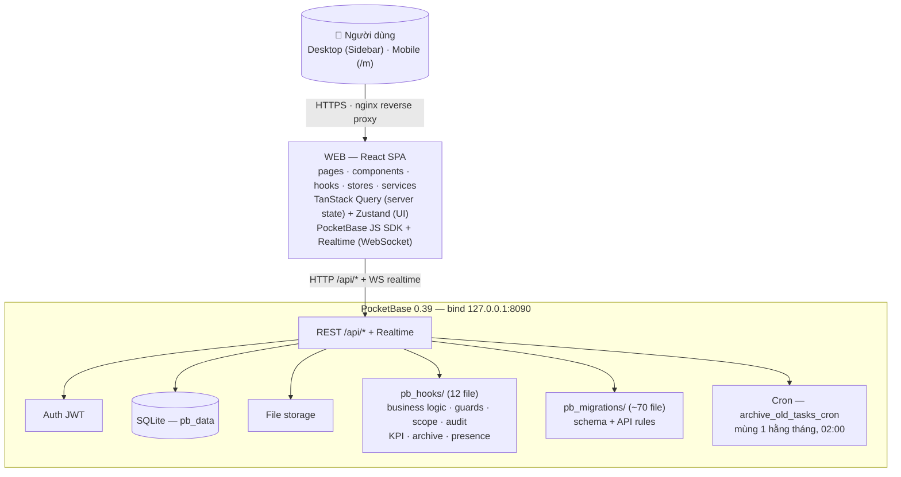
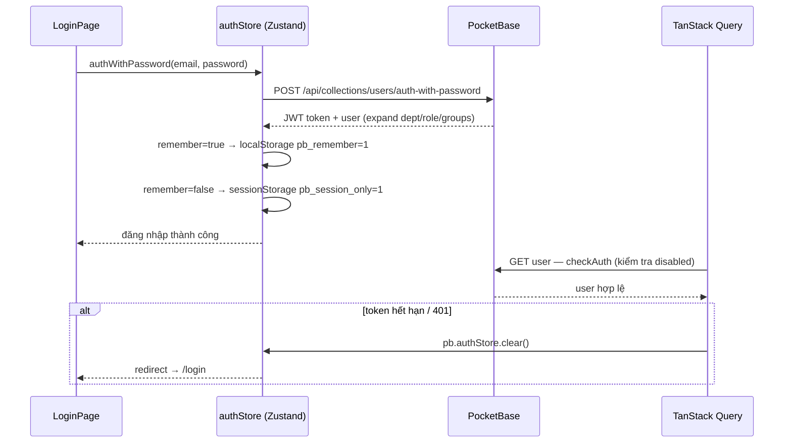
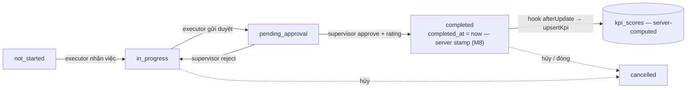
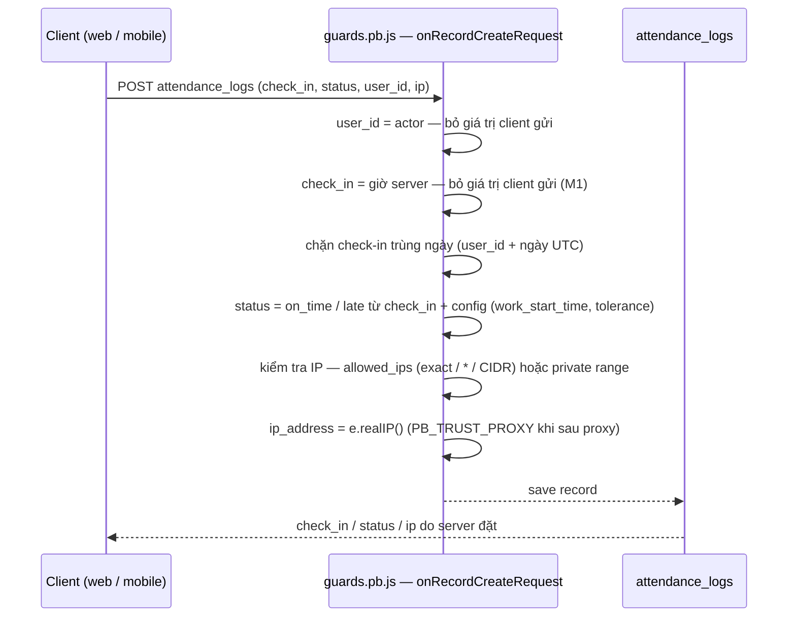
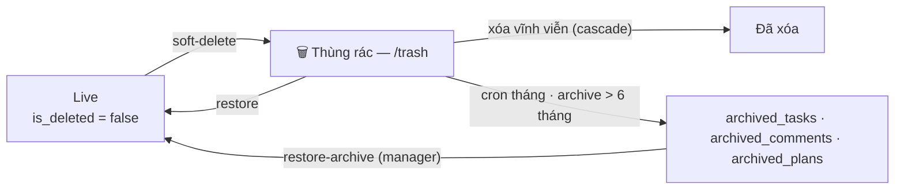
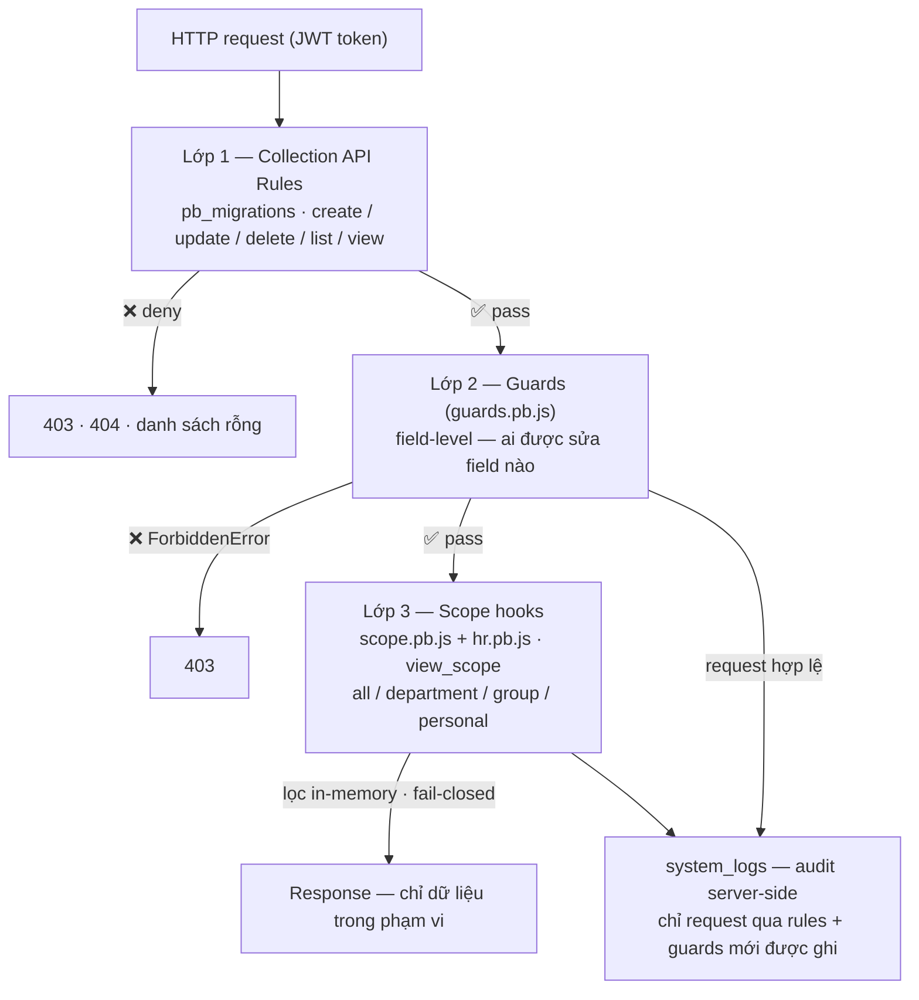

# Kiến trúc tổng thể — MBS Planner (iPlanner)

> Tài liệu mô tả kiến trúc hiện tại của monorepo: backend (PocketBase), web (React SPA), shared types.
> Cập nhật theo mã nguồn thực tế (xem thêm `PLAN.md` — kế hoạch gốc, đã lệch một phần).
> Các sơ đồ Mermaid dưới đây GitHub render trực tiếp (xem dạng raw nếu cần giữ bản text).
> Chi tiết từng collection, field và API rules xem **`DATA_DICTIONARY.md`**.

---

## 1. Sơ đồ tổng quan



- **Frontend và backend cùng origin** trong production: web được serve qua nginx, proxy `/api` → PocketBase chỉ bind `127.0.0.1:8090` (xem `docker-compose.yml`, `backend/deploy/nginx.conf.example`).
- **Không có mobile native**: mobile là web responsive (`/m/*`), tự nhận diện qua `?device=mobile|desktop` hoặc UA (`web/src/utils/device.ts`).

---

## 2. Cấu trúc monorepo

```
/
├── backend/
│   ├── pb_hooks/          # 12 file JS hooks + helpers (business logic & bảo mật)
│   ├── pb_migrations/     # ~70 migration (schema + API rules, có track)
│   ├── pb_data/           # SQLite + file storage (gitignored)
│   ├── pb_public/         # static files (hướng dẫn sử dụng…)
│   ├── deploy/            # nginx.conf.example
│   ├── test/              # guard_proxy.test.js
│   ├── Dockerfile         # PocketBase 0.39.10 (alpine)
│   └── pocketbase.exe     # binary chạy local (Windows)
├── web/
│   ├── src/
│   │   ├── api/           # client.ts — pb instance + remember-me + file URL
│   │   ├── stores/        # Zustand: authStore, toastStore, pageTitleStore
│   │   ├── hooks/         # ~27 hooks (query/mutation theo từng entity)
│   │   ├── pages/         # 22 trang desktop + 8 trang mobile (pages/mobile)
│   │   ├── components/    # shared, layout, plans, tasks, chat, hr, kpi, admin…
│   │   ├── services/      # dataService (import/export) — audit đã chuyển hẳn về server
│   │   └── utils/         # constants, filters, format, importExport, kpi, sanitize…
│   ├── vite.config.ts     # proxy /api, PWA, manualChunks
│   └── package.json       # React 19, Vite 6, TS 5.8, Tailwind 4, RQ5, Zustand 5
├── shared/
│   ├── types.ts           # ~30 interfaces (User, Plan, Task, Proposal, …)
│   └── validators.ts      # password/file validation (dùng chung)
├── docker-compose.yml     # pocketbase + web dev container
├── Makefile               # up/down/restart/logs/pb-shell/web-shell
└── PLAN.md                # kế hoạch gốc (12 tuần) — đã lệch thực tế
```

---

## 3. Backend — PocketBase

### 3.1 Collections (27)

```
┌─ Nghiệp vụ cốt lõi ──────────────────────────────────────────────┐
│ users (_pb_users_auth_)  roles  departments  professional_groups │
│ plans ──< tasks ──< proposals ──< comments                       │
│ kpi_scores (server-computed, đóng quyền ghi)                    │
├─ Nhân sự & hành chính ──────────────────────────────────────────┤
│ employee_profiles  qualifications  salary_records                │
│ work_experiences  leave_requests  leave_balances                 │
│ attendance_logs  attendance_configs                              │
├─ Trao đổi ───────────────────────────────────────────────────────┤
│ chat_messages (kênh org/dept/group)  announcements               │
│ notifications (owner-bound)  system_logs (audit, manager-only)   │
├─ Lưu trữ ────────────────────────────────────────────────────────┤
│ archived_tasks  archived_comments  archived_plans                │
├─ Hiện diện ──────────────────────────────────────────────────────┤
│ presence_heartbeats  presence_campaigns  presence_check_logs     │
└──────────────────────────────────────────────────────────────────┘
```

Quan hệ chính:

```
departments 1─* users *─1 roles
roles 1─* users
professional_groups *─* users (group_ids)
plans 1─* tasks (plan_id); plans.leader_id→users; host/partner→departments
tasks.executor/supervisor→users; collaborator_ids→users[]
tasks 1─* proposals (extension/cancellation)
tasks 1─* comments (quote_id tự tham chiếu)
tasks 1─1 kpi_scores (sinh ra khi task completed)
tasks 1─1 attendance… không liên quan — chấm công theo user
users 1─* leave_requests / leave_balances / attendance_logs
tasks → archived_tasks (snapshot khi archive; original_id giữ liên kết)
```

### 3.2 Hooks — `backend/pb_hooks/` (12 file)

> ⚠️ PB 0.26 chạy mỗi file trong context riêng → mọi helper phải `require(__hooks + "/helpers.js")` bên trong handler.

| File | Sự kiện / Endpoint | Chức năng |
|---|---|---|
| **all.pb.js** | `onRecordAfterCreateSuccess` | tasks → recalc plan.progress; notify participants; **upsert KPI**; comments → notify mention/reply; proposals → notify supervisor; announcements → fan-out notify mọi user; leave_requests → **auto-approve cho role leadership** |
| | `onRecordAfterUpdateSuccess` | tasks → recalc progress + notify + upsert KPI; proposals → notify requester; leave_requests → **recompute leave balance** |
| | `onRecordAfterDeleteSuccess` | tasks → **cascade xóa** kpi_scores/proposals/comments/notifications + recalc plan; plans → tasks rời plan; leave_requests → recompute balance |
| **guards.pb.js** | `onRecordUpdateRequest` | users: chặn tự sửa role_id/verified/disabled/group_ids/department_id/email; tasks: executor chỉ đổi status, supervisor chỉ trường an toàn, **cấm tự rate**; attendance_logs: owner chỉ set check_out; leave_requests: cấm tự duyệt + approver chỉ đổi status/approver/rejection; proposals: supervisor duyệt / requester rút; chat_messages: author chỉ sửa content/files |
| | `onRecordCreateRequest` | announcements: tự gán author_id; chat_messages: ép user_id = actor + kiểm tra quyền kênh; attendance_logs: chặn check-in trùng + **status do server tính** + **kiểm tra IP nội bộ** |
| | (A11 audit) | Thêm 3 handler create/update/delete đăng ký **sau** guard handler — ghi system_logs với actor từ session + IP thật (`e.realIP`), chỉ khi request vượt qua rules + guards |
| **audit.pb.js** | `onRecordAuthWithPasswordRequest` | Ghi nhật ký **đăng nhập** (cả thành công lẫn thất bại) — thay cho logAction client-side |
| **scope.pb.js** | `onRecordsListRequest`, `onRecordViewRequest` | **Enforce `view_scope`** (all/department/group/personal) cho plans, tasks, kpi_scores — lọc in-memory, fail-closed khi lỗi |
| **hr.pb.js** | `onRecordsListRequest`, `onRecordViewRequest` | Tương tự cho salary_records, employee_profiles, qualifications, work_experiences theo `can_view_salary` |
| **helpers.js** | module dùng chung | `roleInfo`, `scopeContext`, `taskParticipantIds`, `notifyTask`, `recalcPlanProgress`, `recomputeLeaveBalance`, `upsertKpi`, `isManager`, `isPrivateIp`/`ipInList` (CIDR) |
| **archive.pb.js** | `cronAdd` + 4 routerAdd | **Cron tháng** (1st 02:00) archive dữ liệu > 6 tháng; endpoint archive/stats/restore (manager-only) |
| **kpi.pb.js** | `routerAdd POST /recalc-kpi` | Tính lại KPI cho mọi task completed (manager-only, backfill) |
| **leave.pb.js** | `routerAdd POST /approve-leave` | Duyệt/từ chối nghỉ phép kèm kiểm tra `approval_scope` + quy tắc ≥3 ngày |
| **presence.pb.js** | 7 routerAdd | heartbeat / present / start-stop campaign / run-check / campaigns / check-logs |
| **users.pb.js** | 3 routerAdd | upsert-employee-profile (owner/manager), verify-user (superuser), change-user-email (manager) |
| **trustproxy.pb.js** | `onBootstrap` | Bật trusted proxy headers khi `PB_TRUST_PROXY=true` (cho chấm công lấy IP thật — persist qua migration 1792300000) |

### 3.3 Custom endpoints (16)

| Endpoint | Quyền | Chức năng |
|---|---|---|
| `POST /api/custom/archive-tasks` | manager | Chạy archive thủ công (dry-run hoặc thật) |
| `GET  /api/custom/archive-stats` | manager | Thống kê đủ điều kiện / đã archive |
| `POST /api/custom/restore-archive` | manager | Khôi phục archived task/plan về live |
| `POST /api/custom/recalc-kpi` | manager | Tính lại toàn bộ KPI |
| `POST /api/custom/approve-leave` | can_approve_leave | Phê duyệt đơn nghỉ (scope-check) |
| `POST /api/custom/presence/heartbeat` | user | Ping heartbeat (throttle 15s) |
| `GET  /api/custom/presence/present` | manager | Ai đang online (TTL 60s) |
| `POST /api/custom/presence/start` | manager | Mở đợt điểm danh (1 campaign active) |
| `POST /api/custom/presence/stop` | manager | Đóng đợt |
| `POST /api/custom/presence/run-check` | manager | Đối chiếu heartbeat trong window → logs |
| `GET  /api/custom/presence/campaigns` | manager | Lịch sử campaign + thống kê |
| `GET  /api/custom/presence/check-logs` | manager | Chi tiết ai có mặt/vắng |
| `POST /api/custom/upsert-employee-profile` | owner/manager | Atomic upsert hồ sơ nhân sự |
| `POST /api/custom/verify-user` | superuser | Duyệt user |
| `POST /api/custom/change-user-email` | manager | Đổi email user |
| Cron: `archive_old_tasks_cron` | — | `0 2 1 * *` — archive 6 tháng |

### 3.4 Cron

```
archive_old_tasks_cron  ── 0 2 1 * * (01:00 UTC mùng 1 hằng tháng)
  1. Ưu tiên 1: plan trong thùng rác → archive cả plan + toàn bộ task
  2. Ưu tiên 2: task trong thùng rác → archive
  3. Ưu tiên 3: task completed/cancelled > 6 tháng → archive
     (plan chỉ archive khi 100% task đủ điều kiện, kèm warnings)
  4. Move comments → archived_comments, snapshot plan → archived_plans
```

---

## 4. Frontend — Web

### 4.1 Phân lớp

```
web/src
├── api/client.ts          pb instance (base "/" → proxy), setRememberMe, getFileUrl
├── stores/                authStore (login/checkAuth/logout), toastStore, pageTitleStore
├── hooks/                 useXxx.ts: useQuery + useMutationWithToast(invalidate + toast + audit)
├── services/
│   └── dataService        import/export Excel/CSV/JSON + template (admin)
│   (audit logging đã chuyển hẳn về server: guards.pb.js + audit.pb.js + endpoints)
├── components/
│   ├── shared/            Modal, Toast, DonutChart, FilePreviewModal, ExportButton,
│   │                      PdfExportMenu, Pagination, TabBar, Skeleton, ErrorBoundary…
│   ├── layout/            AppLayout, Sidebar, Header, NotificationDropdown, ProtectedRoute
│   ├── plans/             PlanInlineForm, InteractiveGanttChart, CalendarView
│   ├── tasks/             TaskInlineForm, CommentSection
│   ├── proposals/         ProposalSection
│   ├── chat/              ChannelChat, chatShared
│   ├── leave/  hr/  kpi/  reports/  attendance/  admin/
└── utils/                 constants (status labels), filters (soft-delete filter),
                           format, importExport, exportPdf, reportPrint, kpi, sanitize, device
```

### 4.2 Routing (react-router 7)

```
/                    → redirect theo device (/m hoặc /dashboard)
/login
ProtectedRoute ─ DesktopGate ─ AppLayout (Sidebar + Header)
  /dashboard      Dashboard (4 cards, alerts, donut chart)
  /my-day         Việc của tôi hôm nay
  /plans          Kế hoạch & Nhiệm vụ (table + filter + Gantt/Calendar)
  /plans/:id      PlanDetail (info + tasks + Gantt)
  /tasks/:id      TaskDetail (info + proposal + comments)
  /reports        Báo cáo (filter + charts + export)
  /kpi            KPI (bảng điểm + Leaderboard)
  /discussion     Chat (kênh org/dept/group, realtime)
  /announcements  Bảng tin (+/:id)
  /attendance     Chấm công (check-in/out, wifi config, history)
  /leave          Nghỉ phép (đơn + balance + duyệt)
  /hr  /hr/:id    Nhân sự (profile, lương, bằng cấp, kinh nghiệm)
  /profile        Redirect → /hr/:id (self)
  /notifications  Danh sách thông báo
  /trash          Thùng rác (khôi phục / xóa vĩnh viễn)  [admin]
  /admin          Quản trị: phòng ban, chức vụ, user, tổ, điểm danh, import/export [admin]
  /admin/logs     Nhật ký hệ thống [admin]
  /admin/data     Dữ liệu: export/import theo collection [admin]

ProtectedRoute ─ MobileGate ─ MLayout (tab bar dưới)
  /m                    Dashboard mobile (gọi usePresenceHeartbeat)
  /m/notifications      Thông báo + badge chưa đọc
  /m/announcements      Bảng tin (+/:id)
  /m/tasks              Việc của tôi
  /m/kpi                KPI
  /m/attendance         Chấm công
  /m/profile            Cá nhân
```

### 4.3 State & dữ liệu

- **Server state** — TanStack Query: mỗi entity một hook (`usePlans`, `useTasks`, `useComments`, `useKpiScores`, `useNotifications`…). Cấu hình chung: staleTime 2p, retry 1, **401 → clear auth + redirect login**.
- **Client state** — Zustand: `authStore` (user + isAuthenticated, remember-me 2 chế độ), `toastStore`.
- **Realtime** — `useRealtimeNotifications` subscribe `notifications` (filter theo user_id) → toast + invalidate; chat dùng subscribe realtime riêng.
- **Mutations** — pattern chuẩn: `useMutationWithToast` = mutate + toast + invalidate cache. **Audit là server-side** (guards.pb.js/audit.pb.js) — client không còn ghi system_logs.

---

## 5. Luồng dữ liệu chính

### 5.1 Auth & session

```
LoginPage ── authWithPassword ──► PB (JWT) ──► authStore.user (expand dept/role/groups)
  ├─ remember=true  → localStorage pb_remember=1
  └─ remember=false → sessionStorage pb_session_only=1 (tự xóa khi đóng trình duyệt)
checkAuth(): token hợp lệ → getOne(user) → kiểm tra disabled → set user
401 bất kỳ query → pb.authStore.clear() → ProtectedRoute → /login
```



### 5.2 Vòng đời Kế hoạch → Nhiệm vụ → KPI

```
Tạo Plan (leader, host dept, partner depts, dates, is_sudden/is_high_impact)
   └─ Tạo Task (executor, supervisor, collaborators, category, deadline)
        │  [hook afterCreate] recalcPlanProgress(plan) → plan.progress, plan.status
        │  [hook afterCreate] notifyTask(participants) ; upsertKpi
        ▼
Task chuyển trạng thái (guard chặn field ngoài phạm vi)
  not_started → in_progress → pending_approval → completed   (executor chỉ 2 bước đầu)
  supervisor: approve/reject rating + completed_at
        │  [hook afterUpdate] recalcPlanProgress ; upsertKpi (chỉ khi completed)
        ▼
plan.progress = trung bình cộng % tiến độ các task (completed=100, pending=75, in_progress=50)
plan.status: tất cả completed → "completed"; có task chạy → "in_progress";
  completed + còn task chưa xong → quay lại "in_progress"; paused/cancelled không bao giờ bị tự ghi đè
KPI: base(10/12 đột xuất) × (0.3×schedule + 0.7×rating/10) × hệ số khó (1.0/1.1/1.2)
  rating: thang 1–10 (nhãn + màu ở web/src/utils/constants.ts, RATING_LABELS/RATING_COLORS/RATING_SCALE)
```



### 5.3 Đề xuất (proposal)

```
Requester (executor/supervisor/collaborator của task)
  ── tạo proposal (type: extension|cancellation, reason, new_deadline) [status bắt buộc pending]
       │  [hook afterCreate] notify supervisor
       ▼
Supervisor: Duyệt ──► proposal.approved + task.deadline mới / status=cancelled   (client 2 bước)
            Từ chối ──► proposal.rejected + task về in_progress
Requester:  Rút lại (chỉ khi còn pending) — không tự duyệt
Guard: chỉ supervisor của task (bản ghi gốc) mới approve/reject; can_manage/superuser pass
```

### 5.4 Comment, mention & notification

```
CommentSection
  ── tạo comment (content, files ≤20MB whitelist, quote_id)
       │  [hook afterCreate] quét @Tên trong content → notify mention
       │                      participants còn lại → notify reply
       ▼
notifications: { user_id, type, reference_id: JSON {taskId, taskName} }
  ├─ NotificationDropdown / NotificationsPage (lọc theo type)
  ├─ Realtime subscribe → toast tức thì
  └─ useUnreadCount → badge (mobile + dropdown)
Announcement tạo → fan-out notification "announcement" cho mọi user active
```

### 5.5 Nghỉ phép

```
Tạo đơn (type, start/end, total_days, period, reason)  [createRule: user_id = actor]
  ├─ Role leadership + can_approve_leave → auto-approve (hook afterCreate)
  └─ Ngược lại → pending → approver (can_approve_leave + approval_scope)
       ├─ scope=all: duyệt được mọi đơn
       ├─ scope=department: chỉ cùng dept VÀ total_days < 3
       └─ scope=group: chỉ chung tổ VÀ total_days < 3
[hook afterUpdate/Delete] recomputeLeaveBalance(user, year) — mặc định 12 ngày/năm
```

### 5.6 Chấm công (anti-gian lận)

```
Check-in (mobile hoặc web)
  [guard create] user_id = actor (ép)  · chặn check-in trùng ngày
                 status do server tính (so work_start_time + tolerance)
                 kiểm tra IP: allowed_ips (exact/*/CIDR) hoặc private range
                 ip_address = IP thật từ request (PB_TRUST_PROXY khi sau proxy)
Check-out: owner chỉ set check_out 1 lần, không sửa được gì khác
Admin: attendance_configs (office, wifi, allowed_ips, giờ làm việc, tolerance)
```



### 5.7 Điểm danh hiện diện (presence)

```
Mobile mở app → usePresenceHeartbeat → POST /presence/heartbeat (throttle 15s)
Manager: start campaign ──(1 campaign active)──► stop ──► run-check
  run-check: lấy mọi heartbeat trong window [started_at → ended_at]
             đối chiếu với mọi user active → upsert presence_check_logs (responded/absent)
Manager xem: campaigns (thống kê) · check-logs (từng người + thiết bị)
```

### 5.8 Vòng đời dữ liệu 3 tầng

```
Live (is_deleted=false) ──soft-delete──► Thùng rác (/trash) ──restore──► Live
                                              │ xóa vĩnh viễn (cascade)
                                              ▼
                                    Archive (cron tháng, >6 tháng)
                                              │ snapshot → archived_tasks/comments/plans
                                              ▼
                                    Restore (/api/custom/restore-archive, manager)
```



### 5.9 Import / Export (admin)

```
/admin/data
  Export: collection → xlsx/csv/json (COLLECTION_FIELDS whitelist; KHÔNG xuất password)
  Import: file (xlsx/csv/json) hoặc paste → sanitizeRow (strip tag, whitelist field)
          → chunk 10/create → báo lỗi theo dòng (parseFieldErrors)
  Template: CSV tiêu đề tiếng Việt, map label→field
```

---

## 6. Tầng bảo mật (3 lớp)

```
Lớp 1 — Collection API Rules (pb_migrations)
   create/update/delete/list/view per collection
   owner-bound create: comments.user_id, proposals.requester_id, notifications.user_id,
                       attendance_logs.user_id, leave_requests.user_id
   system_logs: createRule = null (chỉ server $app.save mới ghi — chống giả mạo log)
   kpi_scores: đóng mọi quyền ghi (server-computed)
   chat_messages: read theo kênh (org = mọi người; dept = cùng dept; group = chung tổ)
   archived_*: đọc mở, ghi manager-only

Lớp 2 — Guards (guards.pb.js)
   Field-level: ai được đổi field nào (executor chỉ status; owner attendance chỉ check_out;
   proposer không tự duyệt; user không tự sửa quyền; chat author chỉ content/files…)

Lớp 3 — Scope hooks (scope.pb.js + hr.pb.js)
   view_scope (all/department/group/personal) lọc plans/tasks/kpi_scores + 4 collection HR
   Fail-closed khi hook lỗi; lọc in-memory (totalItems giữ nguyên — tradeoff đã ghi chú)

Custom endpoints: tự kiểm tra isManager / can_approve_leave / ownership
```



---

## 7. Deployment

```
docker-compose.yml
├── pocketbase (build backend/Dockerfile, PB 0.39.10)
│     ports: 127.0.0.1:8090:8090   ← chỉ localhost
│     volumes: pb_data, pb_hooks, pb_migrations, pb_public
│     env: PB_TRUST_PROXY (mặc định false)
└── web (node:24-alpine, dev: npm ci && vite --host)
      ports: 5173:5173  · env: VITE_PB_UPSTREAM=http://pocketbase:8090

Production (gợi ý từ deploy/nginx.conf.example):
  nginx ── SSL ──► static web ── /api proxy ──► pocketbase (127.0.0.1:8090, không publish)
  PB_TRUST_PROXY=true chỉ khi nginx overwrite X-Forwarded-For

Makefile: up · down · restart · logs · status · pb-shell · web-shell
Web CI: npm run ci = typecheck + lint + test + build (vitest, ~20 test files)
CI/CD: .github/workflows/ci.yml
  ├─ web: npm ci → npm run ci
  └─ backend: tải PocketBase 0.39.10 → node --check pb_hooks + pb_migrations →
     unit tests → 3 integration tests trên instance FRESH-BOOT (migrations tự dựng schema)
```

### 7.3 Schema bootstrap & KPI single-source (2026-08)

**Instance mới tự bootstrap từ migrations** — `backend/pb_migrations/` giờ là chuỗi đầy đủ:

- `1784000001..1784000010_created_*` — **sinh tự động** bởi `web/scripts/gen-created-migrations.mjs`
  từ `web/scripts/pb-schema.json` (snapshot chuẩn, tái xuất từ instance boot-by-migrations).
  Dùng đúng collection id mà các `updated_*` tham chiếu (`pbc_3865025440` …) và đổi id trong mọi
  relation field tương ứng. `users` là collection auth hệ thống (tự sinh khi boot) nên file tương ứng
  là **sync**: thêm các field tuỳ biến (`department_id`, `role_id`, `reminder_days`, `disabled`).
- Các relation tới collection chưa tồn tại lúc tạo được **hoãn** sang migration sau target:
  `plans.group_id` + `users.group_ids` (sau `professional_groups` 1786900000),
  `comments.quote_id` (tự bản thân comments — file 1789000000 thêm sau).
- **23 migration `updated_*` cũ được guard idempotent** (skip add nếu field đã tồn tại / skip
  remove nếu chưa có) để chạy được trên schema đã đầy đủ; 2 file migration dev-leftover
  (`deleted_t1`, `created_probe_col`) đã **xoá hẳn** (no-op với fresh boot, không còn lý do tồn tại).
  Instance cũ boot bình thường: các file mới no-op (collection đã tồn tại).
- Khi sửa schema: cập nhật `DATA_DICTIONARY.md` → tái sinh snapshot trên instance thật →
  chạy `node web/scripts/gen-created-migrations.mjs` (idempotent) → thêm migration `updated_*`
  cho các deployment hiện hữu.

**Schema khai báo là single-source** — `web/scripts/schema-defs.mjs` là nơi duy nhất định nghĩa
26 collection + các field patch sau khi có relation. `bootstrap-schema.mjs` chỉ còn logic áp
dụng lên PocketBase. Script `create-collections.mjs` (bản khai báo trùng, đã lệch rules/id so
với bootstrap) **đã bị xoá**.

`web/scripts/pb-schema.json` là **snapshot của một instance cụ thể** — nó giữ collection id
thật (`pbc_<random>`) mà `sync-schema.mjs` cần để `pb.collections.import()` khớp đúng thay vì
tạo collection trùng, nên không sinh tự động từ `schema-defs.mjs`. Thay vào đó,
`src/test/schemaDefs.test.ts` khẳng định hai nơi không lệch nhau về **tên collection và tập field
nghiệp vụ** (bỏ qua field hệ thống `id`/`created`/`updated`), nên quên cập nhật một trong hai
sẽ bị chặn ở CI.

**KPI formula là single-source**: `backend/pb_hooks/_kpi-formula.cjs` (hàm thuần, không phụ thuộc
PB/React). Backend nạp qua `require(__hooks + "/_kpi-formula.cjs")` (helpers.js `_computeKpi`), web
nạp qua `web/src/utils/kpi.ts` (`calculateKpi`) — Vite bundle `.cjs` qua interop, kiểu khai báo tại
`_kpi-formula.d.cts`. Parity được giữ bằng 2 bộ test vector trùng giá trị
(`backend/test/helpers_logic.test.js` + `web/src/test/kpi.test.ts`) và 1 assertion trong
`harden_integration.test.js` xác nhận điểm do hook tính đúng công thức chung.

### 7.1 Biến môi trường (web)

> Không có file `web/.env.example` trong repo — file `web/.env` đã bị commit nhầm và
> sau đó được **untrack** (2026-08): mọi file `web/.env*` đều nằm trong `.gitignore`
> (trừ khi được thêm lại có chủ đích). Bảng dưới là tài liệu tham chiếu chính thức
> cho các biến; tạo `web/.env` cục bộ khi cần (bản mẫu: `docker-compose.yml` + `vite.config.ts`).

| Biến | Mặc định | Mô tả |
|---|---|---|
| `VITE_PB_URL` | `"/"` | Base URL cho PocketBase JS SDK (same-origin qua proxy `/api`). Chỉ cần đặt khi API ở origin khác (ví dụ PocketBase hosted). |
| `VITE_PB_UPSTREAM` | `http://localhost:8090` | Target của Vite proxy `/api` (đọc lúc dev-server start — xem `vite.config.ts`). |
| `VITE_USE_POLLING` | — | `true` để bật fs-watch polling (docker volume mount, Windows). |

### 7.2 Biến môi trường (backend / scripts, dev)

| Biến | Mặc định | Mô tả |
|---|---|---|
| `PB_URL` | `http://localhost:8090` | Đích cho `web/scripts/*.mjs` (setup/sync/seed). |
| `PB_ADMIN_EMAIL` / `PB_ADMIN_PASSWORD` | — | Superuser + tài khoản admin (bắt buộc cho `setup-pb.mjs`, `bootstrap-schema.mjs`, `sync-schema.mjs`, `seed-data.mjs`). |
| `PB_TRUST_PROXY` | `false` | `true` chỉ khi đứng sau reverse proxy overwrite `X-Forwarded-For` (chấm công lấy IP thật). |
| `TZ` | — | Container phải chạy theo giờ công ty (`Asia/Ho_Chi_Minh`) để status on-time/late đúng. |
